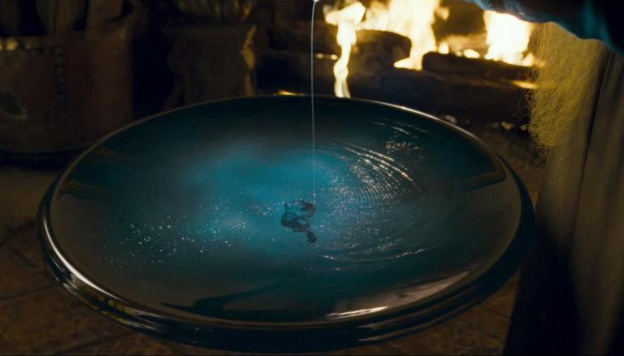

My name is Faisal Alam and I am an undergraduate physics and mathematics major at Franklin & Marshall College in Lancaster, PA.

Despite the best of my efforts I have always been lousy at keeping coherent, organized notes on my classes and independent studies. This was a perfectly fine way to go about my studies in high school classes. But now I find it increasingly difficult to retain things that I am learning. The course contents are more difficult to digest, textbooks are opaque and there is quite enough to do every day without having to relearn material that I should already know.

This blog will serve as a repository of bits and pieces of notes on various topics of interest to me, things that I am bubbling to share with someone, things that are too big for me to grapple with in my mind. A Dumbledorian Pensieve if you will!

I will aim to keep the notes as self contained and dissected as possible. I have often found that explaining a physics or math concept that I have learnt to someone who is a couple of years behind me always solidifies my own understanding of the matter. When I was home the victim would usually be my younger cousin, who, at the time, was very interested in physics and math, or the particularly eager members of the small batch of students I tutored. In fact I still find myself, after having learnt something new, planning out structured lectures to them, even debating the finer points and the sequence in which to introduce the ideas.

The aim in making a blog out of my notes instead of keeping them private is to lull myself into that state. I want to feel as if I am speaking to someone who cares about the subject. If the notes remain private anyway, well ... I have learnt something in writing them in any case. If someone finds them useful, that's a bonus!

I may also write posts compiling study materials that I have found particularly helpful or the occasional rant about certain aspects of contemporary literature.

